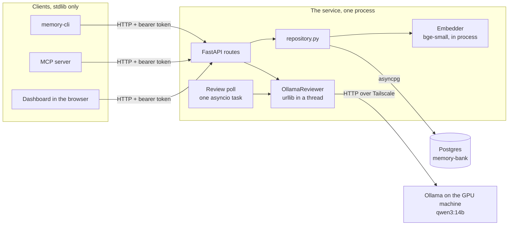
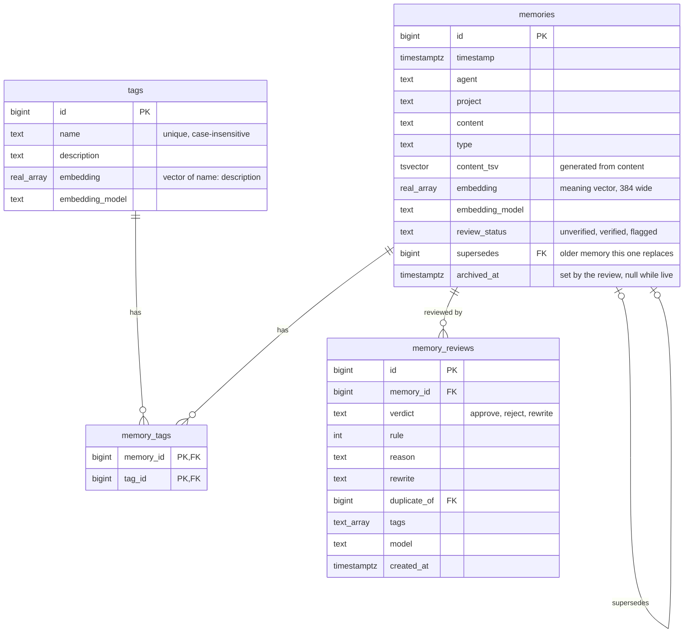
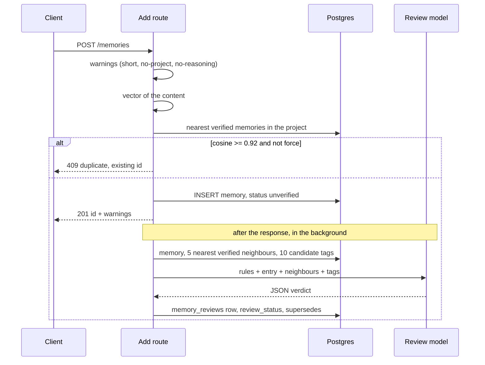
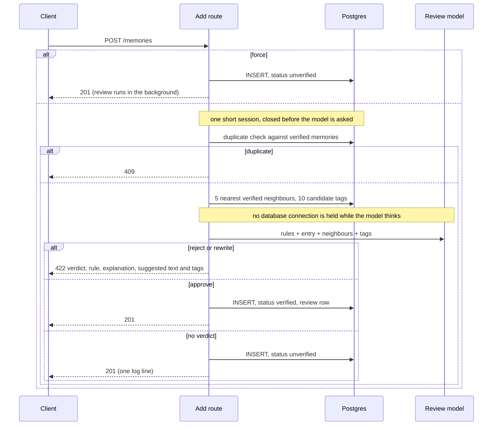
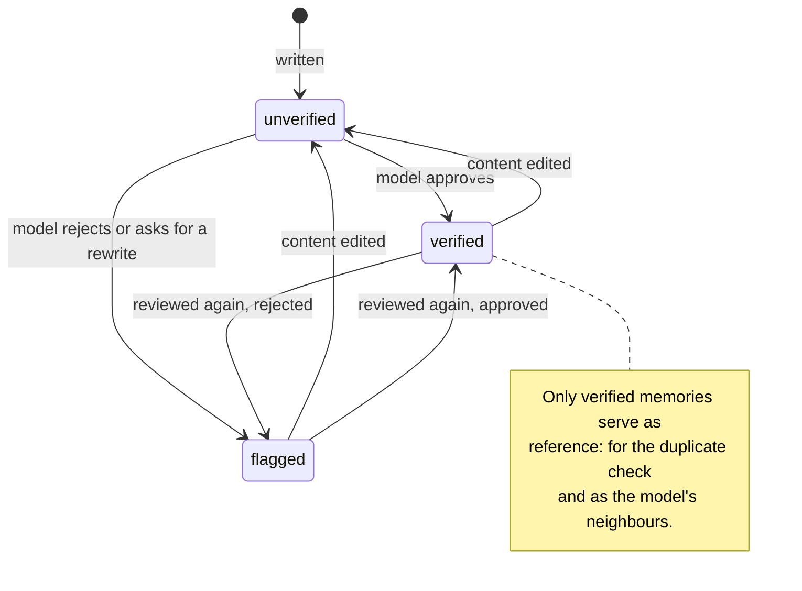
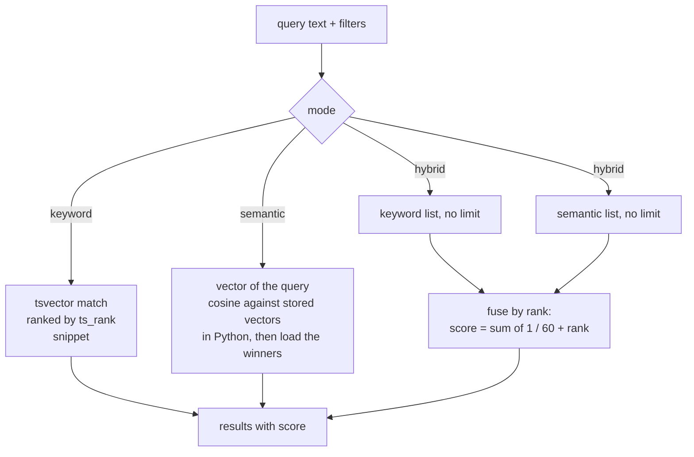
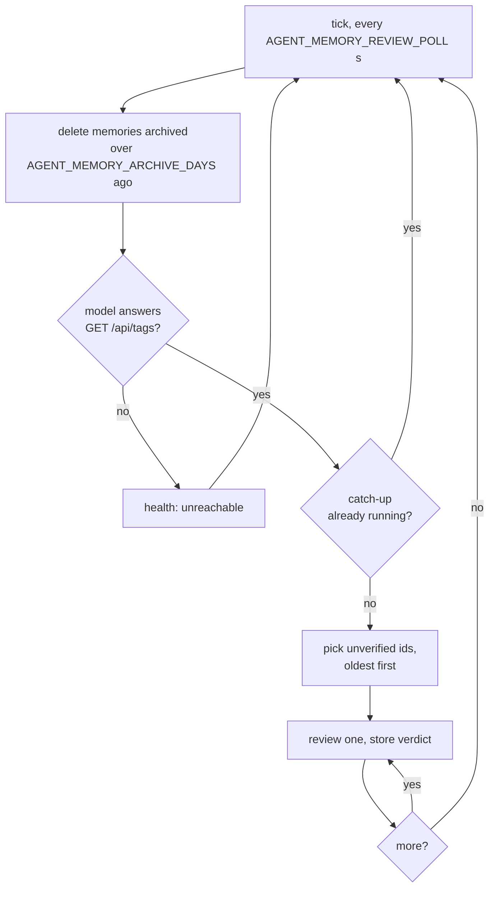
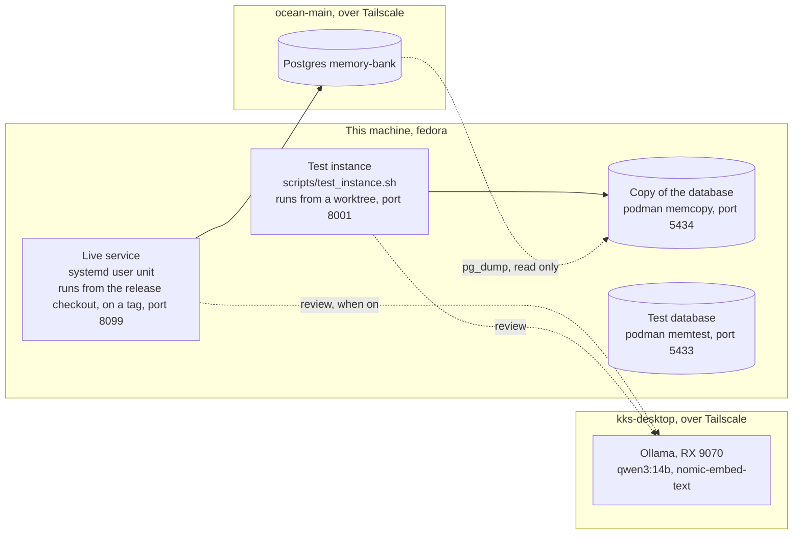

# Architecture — agent-memory

How the `agent_memory` package is built and why. For usage, see [README.md](README.md);
for the agent logging protocol, see [skills/memory/SKILL.md](skills/memory/SKILL.md).

## Overview

**API-first, Postgres-only.** One async FastAPI service owns the database; everything
else is a client. The service is reachable three ways over one codebase — the
`memory-cli` command, the HTTP API directly, and an MCP server — giving AI agents a
persistent, queryable timeline across sessions, searchable by words and by meaning:
auto-timestamped, tagged, scoped by project and agent. The **client surface** (CLI + MCP, both the urllib
`ApiClient`) is stdlib-only and never opens a database; the server is an opt-in extra.

```
Client (CLI / MCP)  ──HTTP──▶  FastAPI service  ──asyncpg──▶  Postgres
  ApiClient (urllib)             async routes                 (schema by Alembic)
  stdlib-only                    → repository → SQLAlchemy 2.0 async
```

## System design

The pictures below say the same as the sections that follow, in one page. They render
on GitHub and in any editor that draws mermaid.

### The parts and who talks to whom



The clients never see a database address. The service is the only thing that opens
Postgres, the only thing that runs the vector model, and the only thing that calls the
review model.

### What is stored



### A write, review in flag mode



The writer never waits for the model. A model that is off, down, slow or answers badly
means no row and one log line; the memory stays stored.

### A write, review in refuse mode



The write waits for the model, but the pool does not: the request's session is first
used for the insert, after the answer, and a session that has run nothing holds no
connection.

### The life of a memory's status



A memory that is superseded keeps its status; `superseded_by` is a link, not a state.
Queries return superseded memories unless `current` is asked for.

### Search



Rank fusion, not score fusion, because `ts_rank` and cosine live on different scales.
A memory found both ways always outranks one found one way at the same rank.

### The poll and the catch-up



Oldest first, one at a time, so each memory is verified before the next one is compared
against it. `POST /admin/review` and `memory review --catch-up` enter the same path and
share the same lock.

### Where things run



The live service runs from a release checkout (`~/workspace/agent-memory-live`) that
is always on a tag; `deploy/deploy.sh` is the only thing that moves it (README,
"Releasing"). The main checkout and the worktrees are for work and never run the live
service, so a reboot cannot start it on unreleased code. The test instance is how new
code meets real data before anything goes live.

## Package layout

```
src/agent_memory/
  config.py            # endpoint/token resolution + agent-name; client settings (JSON)
  client.py            # ApiClient — stdlib urllib HTTP wrapper (the CLI+MCP share it)
  cli.py               # memory-cli command (argparse); presentation only
  mcp_server.py        # FastMCP server wrapping ApiClient — [mcp] extra
  server/              # the API service — [server] extra
    app.py             #   FastAPI app; thin async routes, one txn per request
    db.py              #   async engine/sessionmaker; DSN → asyncpg normalization
    models.py          #   SQLAlchemy 2.0 models — the schema source of truth
    repository.py      #   async data-access functions over an AsyncSession
    schemas.py         #   Pydantic v2 request/response models (the HTTP contract)
    auth.py            #   bearer-token guard (constant-time)
    embedding.py       #   Embedder interface; local fastembed model — [embed] extra, optional
    checks.py          #   the warnings on add (short, no-project, no-reasoning); never block
    review.py          #   the review of each new memory by a model on an Ollama server; off by default
    __main__.py        #   `python -m agent_memory.server` (uvicorn launcher)
alembic/               # migrations; env.py autogenerates from models.Base.metadata
memory-cli             # thin shim on PATH -> agent_memory.cli:main (rule #5)
```

## The seam

The client resolves an **endpoint + token**, never a DB target:

- Endpoint: `AGENT_MEMORY_API` env → config `api_url` → local default
  `http://127.0.0.1:8099`.
- Token: `AGENT_MEMORY_API_TOKEN` env → config `api_token` → sent as `Bearer`.

The server resolves a **DSN**: `AGENT_MEMORY_DB` (a `postgresql://` URL, normalized to
`postgresql+asyncpg://`). The CLI, MCP, HTTP API, and repository all round-trip through
the same Pydantic contract, so behaviour can't drift. The tests check each behaviour
once, in process, and keep to what differs between CLI, API and MCP (output, error
shapes, flags, exit codes) in `tests/test_surfaces.py`.

## Design goals

1. **Persistent continuity** — solve the fresh-slate problem; remember across sessions.
2. **Queryable timeline** — structured filters (date, tag, project, type), not grep.
3. **Fast at scale** — stays fast at 100k+ memories via proper indexing (GIN FTS).
4. **Multi-agent shared memory** — several agents share one DB; cross-agent continuity.
5. **Single writer of the schema** — Alembic owns DDL; the API owns all data access.

## Key decisions

| Decision | Why | Rejected |
|---|---|---|
| **API-first** — the service is the only DB client | One place holds credentials + connection pool; CLI/MCP stay stdlib-only and need nothing installed to reach a shared server | Every client opening its own DB (creds sprawl, no shared server, drift) |
| **Postgres-only** | Real concurrency, `tsvector`/GIN FTS, network-reachable, one deploy target | SQLite (single-file, no network, weaker FTS), a store abstraction over both (dead weight once there's one backend) |
| **SQLAlchemy 2.0 async + asyncpg** | Async all the way to the socket under FastAPI; models double as the Alembic source of truth | Raw asyncpg (hand-rolled schema/migrations), sync ORM (blocks the event loop) |
| **Alembic owns the schema** | Versioned, reviewable migrations; `alembic upgrade head` is the one setup step | Auto-`create_all` at boot (no history, unreviewable changes) |
| **Generated `tsvector` + GIN** | FTS kept in sync by Postgres itself — no triggers; ranked results + `ts_headline` snippets | `LIKE` (slow, no ranking), trigger-maintained column (more moving parts) |
| **Relational tags** (`memories`, `tags`, `memory_tags`) | Indexed tag queries, case-insensitive via `lower(name)`, per-tag descriptor | JSON array (slow, case-sensitive, no descriptor) |
| **Meaning vectors in a plain `REAL[]` column, compared in Python** | Nothing is installed on the database host, and at this row count a scan in Python is fast; switching to pgvector later is one migration | pgvector (an extension the host does not have), an outside service to make the vectors (memories are private; the model runs locally) |

`memory-cli` stays on PATH as a thin shim so the command name and `memory` alias are
unchanged despite the package split (now an entry point onto `agent_memory.cli:main`).

## Database schema

Postgres, created by `alembic upgrade head` (baseline
`alembic/versions/*_baseline_schema.py`). The SQLAlchemy models in `server/models.py`
are the source of truth; the effective DDL:

```sql
-- Memories. content_tsv is a stored, generated tsvector kept in sync by Postgres.
CREATE TABLE memories (
    id          BIGINT GENERATED BY DEFAULT AS IDENTITY PRIMARY KEY,
    timestamp   TIMESTAMPTZ NOT NULL DEFAULT now(),
    agent       TEXT NOT NULL,
    project     TEXT,
    content     TEXT NOT NULL,
    type        TEXT,
    content_tsv TSVECTOR NOT NULL
                GENERATED ALWAYS AS (to_tsvector('english', content)) STORED,
    -- The meaning vector of `content` and the name of the model that made it.
    -- Both NULL until a model has seen the row. Neither is ever returned by the API.
    embedding       REAL[],
    embedding_model TEXT,
    -- Whether the review model has checked the row: unverified until a verdict is
    -- stored, then verified (approve) or flagged (reject or rewrite).
    review_status   TEXT NOT NULL DEFAULT 'unverified'
                    CHECK (review_status IN ('unverified', 'verified', 'flagged')),
    -- The older memory this one reverses or replaces, set from the review
    -- model's verdict and never from a request. Both rows stay; the old one
    -- reads as superseded by the newest row that points at it. Cleared when
    -- the old memory is deleted.
    supersedes      BIGINT REFERENCES memories(id) ON DELETE SET NULL,
    -- When the review archived the row (a reject under rule 2 or 4, or the older
    -- memory of a merge), NULL while it is live. Hidden from every listing and
    -- from the reference set; the poll deletes it after AGENT_MEMORY_ARCHIVE_DAYS.
    archived_at     TIMESTAMPTZ
);
CREATE INDEX idx_content_tsv ON memories USING gin (content_tsv);
CREATE INDEX ix_memories_timestamp ON memories (timestamp);
CREATE INDEX ix_memories_agent     ON memories (agent);
CREATE INDEX ix_memories_project   ON memories (project);
CREATE INDEX ix_memories_type      ON memories (type);
CREATE INDEX ix_memories_review_status ON memories (review_status);
CREATE INDEX ix_memories_supersedes ON memories (supersedes);
CREATE INDEX ix_memories_archived_at ON memories (archived_at);

-- Canonical tags: case-insensitive-unique name + a required descriptor.
CREATE TABLE tags (
    id          BIGINT GENERATED BY DEFAULT AS IDENTITY PRIMARY KEY,
    name        TEXT NOT NULL,
    description TEXT NOT NULL,
    -- The vector of `name: description`, for the tags a review is offered. Set
    -- when the tag is made or its description changes; reindex fills the rest.
    embedding       REAL[],
    embedding_model TEXT
);
CREATE UNIQUE INDEX idx_tags_lower_name ON tags (lower(name));

-- Many-to-many junction (cascades on delete).
CREATE TABLE memory_tags (
    memory_id BIGINT NOT NULL REFERENCES memories(id) ON DELETE CASCADE,
    tag_id    BIGINT NOT NULL REFERENCES tags(id)     ON DELETE CASCADE,
    PRIMARY KEY (memory_id, tag_id)
);
CREATE INDEX ix_memory_tags_tag_id ON memory_tags (tag_id);

-- What the review model said about a memory (Checks on write below). One row per
-- verdict: a re-review adds a row and never writes over one, and every read shows
-- the newest. The rows go with their memory.
CREATE TABLE memory_reviews (
    id           BIGINT GENERATED BY DEFAULT AS IDENTITY PRIMARY KEY,
    memory_id    BIGINT NOT NULL REFERENCES memories(id) ON DELETE CASCADE,
    verdict      TEXT NOT NULL,       -- approve, reject or rewrite
    rule         INTEGER,             -- the rule the entry breaks; NULL on approve
    reason       TEXT NOT NULL,       -- one sentence
    rewrite      TEXT,                -- the suggested text, when the verdict is rewrite
    duplicate_of BIGINT REFERENCES memories(id) ON DELETE SET NULL,  -- the memory it repeats
    tags         TEXT[],              -- suggested tags for the rewrite; NULL when none
    model        TEXT NOT NULL,       -- the name of the model that answered
    created_at   TIMESTAMPTZ NOT NULL DEFAULT now()
);
CREATE INDEX ix_memory_reviews_memory_id_created_at ON memory_reviews (memory_id, created_at DESC);
```

## Full-text search

`content_tsv` is a **stored generated column** (`to_tsvector('english', content)`) with a
**GIN index** — Postgres maintains it on every write, so there are no triggers. Search
(`repository.search`) builds a `plainto_tsquery`, filters with `content_tsv @@ query`,
orders by `ts_rank(content_tsv, query)`, and returns a `ts_headline` snippet whose
markers (`→ … ←`) match the old highlighter so clients render identically. All of it is
expressed with SQLAlchemy `func`, not string SQL.

## Search by meaning

Keyword search only finds rows that share words with the query. A question asked in
other words misses its answer. So each memory also gets a **meaning vector**: 384
numbers, made by the local model `BAAI/bge-small-en-v1.5` (through fastembed, the
`[embed]` extra), scaled to unit length. The vector is stored in `embedding` and the
model's name in `embedding_model`; `add` computes it, an update that changes the
content computes it again. Two texts that mean the same have vectors that point the
same way, so their cosine is close to 1. Every call to the model, on any path, runs
in a worker thread (`asyncio.to_thread`): it is CPU work that takes tens of
milliseconds per text, and on the event loop it stalled every other request.

**No pgvector.** The vector is a plain `REAL[]` column and the comparison runs in
Python on the server, in two steps: `search_semantic` reads only the id and the vector
of every row that passes the filters and has a vector from the running model, scores
each with `cosine`, sorts, cuts to the limit, then loads the winning rows with their
tags and reviews in one query, in score order. Scoring needs only the vectors; loading
whole rows for every candidate would move the text and tags of the whole table per
search once it grows. The same two steps serve the meaning half of the combined
search and the neighbours for a review; the duplicate check needs only the best id
and score, so it stops after the first step. Nothing is installed on the database
host, and at this row count a scan of the vectors in Python takes a few milliseconds.
If the table ever grows past that, switching to pgvector and an index is one
migration; nothing in the API changes.

**Combined search** (`mode=hybrid`, `search_hybrid`) runs the keyword search and the
scoring step of the search by meaning with the same filters and no limit, then merges
the two ranked lists by rank, not by score, because `ts_rank` and cosine live on
different scales. A memory at rank *r* in a list (the first hit is rank 1) adds
`1 / (60 + r)` to its combined score; a memory in both lists gets the sum of both. So a
memory that is first in both lists scores `2 / 61`, one that is first in one list only
scores `1 / 61`, and a memory found both ways always outranks one found one way at the
same rank. The constant 60 (`RRF_K`) keeps the top ranks from crushing everything below
them. Rows are sorted by that score, ties by newest id, then cut to the limit; the rows
only meaning found are loaded after that cut, so no row outside the limit is read
whole. The snippet comes from the keyword hit when there is one.

**Without the model** (`[embed]` not installed, or `AGENT_MEMORY_EMBED_MODEL=off`) the
server runs with a `NullEmbedder`: writes store no vector, `mode=semantic` answers 400
with the reason, `mode=hybrid` serves the keyword half and says so in the response
header `X-Search-Fallback: keyword`.

**Reindex** (`repository.reindex`, `POST /admin/reindex`, `memory reindex`) walks the
rows that have no vector, or one from another model, in batches of 64 and writes a
vector from the current model; memories first, then tags (`name: description`), and
it reports both counts. The server runs it once at start, so the first start
after installing the model, or after a model change, fills the table. Only vectors
from the running model are ever compared, since another model's vector may not even
have the same length.

## Checks on write

`POST /memories` checks a new memory before it is stored.

- **Duplicate refusal.** `find_duplicate` embeds the new content and compares it, in
  Python, with every vector in the same project (a memory with no project is compared
  with the other memories that have none). If the best match scores cosine
  `DUPLICATE_THRESHOLD = 0.92` or above, the route answers `409` with
  `{"reason": "duplicate", "existing_id": <id>, "score": <cosine>}` and stores nothing.
  On unit vectors, 1.0 is the same text and 0.92 is a rewording. `?force=true` (CLI
  `--force`, MCP `force=true`) skips the check. Without the model there are no vectors
  to compare, so nothing is refused.
- **Warnings.** `checks.py` holds three rules as data: `short` (content under 40
  characters), `no-project` (no project given), `no-reasoning` (a `decision` or
  `lesson` whose text has none of the words that say why: because, since, reason, why,
  rejected, instead, so that, cause, trade-off, alternative). The names of the rules
  the entry breaks come back next to the new id. They never block; the memory is
  stored either way.

- **Review by a model.** `review.py` asks a model on an Ollama server what it thinks
  of the entry (`OllamaReviewer`: `POST /api/chat` through `urllib` in a thread, so no
  new package and the event loop stays free). The prompt holds the five rules from the
  skill, copied into `RULES` as data (a test reads the skill file and checks they still
  match; the server never reads that file), the new entry, the five memories of the
  same project closest to it by cosine over the stored vectors (`_nearest`; none when
  there are no vectors), and the ten tags in use closest to it in meaning
  (`tags_for_review`: the entry is embedded once and scored against the vector each
  tag stores for its `name: description`, set when the tag is made or its description
  changes; a tag with no vector yet is not offered until reindex fills it; without an
  embedding model the ten most used tags are offered).
  The model answers one JSON object with nine keys. The first two, `why` (the words of
  the entry that give its reason, or empty) and `new_facts` (what the entry adds to
  the closest neighbour, or empty), make the model look before it judges: without
  them it decided first and then made up a reason. The server drops both. The other
  seven are the verdict: `supersedes`, `duplicate_of`, `verdict` (`approve`, `reject`
  or `rewrite`), `rule`, `reason`, `rewrite` and `tags`.
  `parse_verdict` turns it into a `Verdict` and treats anything else as no answer: a
  missing key (`tags` and `supersedes` may be left out), a rule number that is not a
  rule, a `duplicate_of` or `supersedes` the model was not shown; a tag not on
  the offered list is dropped, and tags on an approve or reject are dropped too. Four
  request settings matter: `think: false` and `format: json`, because otherwise the
  model thinks out loud and returns prose instead of JSON; `temperature: 0`, so the
  answer is as steady as the server allows; and `num_ctx: 8192`, so the rules, the
  entry and five neighbours fit. The verdict is stored in `memory_reviews` (schema above), one
  row per verdict: `set_review` adds a row on a re-review and never writes over one,
  since a verdict is part of the timeline, and every read carries the newest as
  `review` next to the tags. `GET /memories/{id}/reviews` (`memory show <id>
  --reviews`, the MCP tool's `reviews` flag) lists the whole history, newest first
  on the API and oldest first on the CLI. The memory's `review_status` follows the
  newest verdict (`unverified` until one is stored, `verified` on approve, `flagged`
  on reject or rewrite; every read carries it too), and only verified memories are
  reference for `find_duplicate` and `_nearest`, so an entry the model has not
  checked can never vouch for another. The flagged listing joins the newest row per
  memory (`_newest_reviews`, one `DISTINCT ON` subquery), so an older verdict never
  lists a memory the model has since approved.

  **Contradictions and partial repeats.** The prompt's checklist has two cases that
  look at the listed neighbours, each with one short example. An entry that reverses or
  replaces a neighbour (another choice on the same question, an old fact that no longer
  holds) is approved with `supersedes` set to that id; `set_review` stores it in
  `memories.supersedes` (schema above) on the new memory, on every path a verdict is
  stored (the flag-mode background task, the refuse-mode write, the catch-up, a
  re-review), and nothing else ever sets it: the request body has no such field. Every
  read carries `supersedes` and `superseded_by`, the newest memory (by timestamp, then
  id) whose link points at this one. An entry that repeats a neighbour and adds to it
  gets a `rewrite` whose text is the old and the new merged, with `duplicate_of` that
  id and no rule: in flag mode the new memory is stored and flagged with that
  suggestion like any rewrite; in refuse mode the `422` carries `duplicate_of` and the
  merged text, and the CLI ends with `Apply it with 'memory update <old id>' instead of
  adding.` The timeline rule behind both: a memory is never rewritten or deleted on its
  own. A contradiction keeps both records, with the current one marked; a partial repeat
  is merged by the writer, never by the model. `query` and `search` return superseded
  memories as before, sorted as before; `current=true` (`--current`, and the same
  parameter on the MCP tools) hides them, and is off by default.

  **The same request can get two answers.** The Ollama server answers the same request
  differently at times, even at temperature 0 with the same model and the same bytes
  sent: the numbers it works with are rounded on the way, and the batch a request
  lands in changes the rounding. So a re-review can differ from the first verdict, and
  a borderline entry can go either way. The prompt is measured against the verdict set
  in `tests/data/verdict_set.json` (`test_verdict_quality.py`, real model only): every
  entry in it is sent once, no request is repeated, and the pass rate must stay at or
  above the `floor` in that file, which is the lowest of three runs in a row. The
  prompt's examples never share a subject with a test entry: the model borrows the
  example's reason for an entry on the same subject and approves it.

  `AGENT_MEMORY_REVIEW` picks how the review runs (`review_mode`, `make_reviewer`):
  `off` (the default, also for an unknown value or a missing `AGENT_MEMORY_REVIEW_URL`)
  gives a `NullReviewer` that is never called. The old names `warn` and `enforce`
  (`OLD_MODE_NAMES`) still mean `flag` and `refuse` for one release; `review_mode`
  logs one line asking for the new name. In **flag** mode the add route stores the
  memory, the session commits, the answer goes out, and then a FastAPI background task
  runs the review: it reads the memory, its neighbours and the tags on offer in one
  session, closes it, calls the model in a thread, and writes the row in a second
  session, so no database connection sits idle while the model thinks. The writer
  never waits, and nothing is refused or changed because of a verdict. In **refuse**
  mode the route builds the entry from the request and, in one short session of its
  own, runs the duplicate check and finds the entry's neighbours (`neighbours_for`, the
  same rules as `_nearest` for an entry that has no id yet) and the tags; it closes that
  session, calls the model in a thread, and only then uses the request's session, for
  the insert. A session that has run nothing holds no connection, so no pooled
  connection waits on the model (before, one write could hold one for the whole
  `AGENT_MEMORY_REVIEW_TIMEOUT`, 30 s by default, and a few slow writes could keep every
  other request waiting). A `reject` or `rewrite` answers `422` with
  `{"reason": "review", "verdict", "rule", "explanation", "rewrite", "tags", "duplicate_of"}`
  and stores nothing; an `approve` stores the memory and its row in one go, with no
  second call. The duplicate check comes first (`409` before any model call), and
  `?force=true` skips the review as it skips that check; the review then runs in the
  background as in flag mode, so the row is still written.

  **The fallback rule, in every mode:** a model that is off, unreachable, slow (past
  `AGENT_MEMORY_REVIEW_TIMEOUT`, default 30 s) or answering with something that is not
  the expected JSON never blocks a write. The memory is stored, no row is written, and
  the server logs one line. `POST /admin/review` (`memory review --catch-up`) reviews
  the unverified memories, oldest first, one after another in one background task, so
  each verdict is stored before the next memory is compared and memories written while
  the model was off or down get their verdict later; `POST /admin/review/{id}` reviews
  one memory now and replaces its row. `GET /memories/flagged` (`memory review`, MCP
  `memory_flagged`) lists the memories whose verdict is `reject` or `rewrite`, newest
  review first, or with `status` the memories with that review status.

  **The poll.** The model runs on a machine that is off at times, and a catch-up run
  by hand can wait hours, or falls to whoever writes next. So when the review is on
  and `AGENT_MEMORY_REVIEW_POLL` (`review_poll`, default 300 s; `create_app(review_poll=...)`
  overrides it; 0 or less means no poll) is above zero, the lifespan starts one
  asyncio task, `_review_poll`, and cancels it at shutdown. Each tick calls
  `reviewer.reachable()` in a thread (`OllamaReviewer`: `GET /api/tags` with a 2 s
  timeout; `NullReviewer`: False), stores the answer on `app.state.review_model`
  (`reachable` or `unreachable`; `off` when no poll runs) and, when the model answers,
  runs the catch-up the route uses: `_begin_catch_up` takes the one `asyncio.Lock`
  the poll and `POST /admin/review` share, without waiting for it, and picks the
  unverified ids; `_run_catch_up` reviews them in order and releases the lock. A
  tick or a route call that finds the lock taken does nothing (the route answers
  `{"scheduled": 0, "running": true}`), so one catch-up runs at a time. A check that
  raises counts as unreachable, any other error in a tick is one log line, and the
  loop goes on; the log also says when the loop starts, when a catch-up starts (with
  the count) and when it ends. `GET /health` returns `review_model`, and `catch_up`:
  `{"total": n, "done": k}` (on `app.state.catch_up`) while a catch-up runs, else null. `update` with new
  content sets the memory back to `unverified` and deletes its review rows and its
  `supersedes` link (every verdict was about the old text), so the next catch-up reads
  it again; a change of tags, project or type alone keeps all three.

**The archive.** `set_review` archives a memory (`archived_at`, schema above) on two
verdicts: a `reject` whose rule is in `ARCHIVE_RULES` (2, a diary line; 4, what git holds),
which archives the memory itself, and a merge (a `rewrite` with `duplicate_of`), which
archives that older memory and gives the newer one `supersedes` pointing at it when the
verdict set no link. A reversal (an approve with `supersedes`) archives nothing. Every
listing, search mode, count, `/projects`, `/agents`, `/tags`, `/stats` and the reference
set (`_reference`, so `find_duplicate` and `_nearest`; `unverified_ids`; the tags offered)
go through `_archived_cond`, which keeps to live rows, or with `archived=true` on the list
routes to archived rows only. A read by id still returns one. `POST /memories/{id}/restore`
clears the stamp; new content from `update` clears it too, since the catch-up never picks
an archived memory and the new text needs its check. Each poll tick first deletes the
memories archived more than `AGENT_MEMORY_ARCHIVE_DAYS` days ago (`delete_archived`,
default 30, 0 or less keeps them), whether or not the model answers, with one log line
when it deletes any. The poll runs only while the review is on, and only the review
archives. There is no action log: the review history already holds each verdict and its
reason.

Before a check goes live, `scripts/replay_write_checks.py` runs the duplicate check and
the warnings over a copy of the database in write order and prints what each would
have said (see README).

## Data flow

**Add** — run the checks above (a duplicate is refused, warnings are collected, in
refuse mode the model reads the entry first), then insert a `Memory`; for each `{"name", "description"}` tag, reuse the existing
row (updating its descriptor only if a new non-blank one is given) or create it
(defaulting a new tag's descriptor to its own name), then link in `memory_tags`;
`content_tsv` is generated automatically. When the server has an embedding model, `add` also
stores the content's vector in `embedding` and the model's name in `embedding_model`;
an update that changes the content recomputes both, any other update leaves them alone.
With no model both stay NULL. In flag mode the review runs after the response and
writes its row to `memory_reviews`. **Query** — build a `SELECT` with
`selectinload(tags)` and `WHERE` clauses from the filters (date window, project, agent,
type, `tags.any(lower(name)=…)`), `ORDER BY timestamp DESC`. **Search** — `mode`
picks keyword search (Full-text search above), search by meaning, or the combined
search (Search by meaning above). Both take `current`, which adds `NOT EXISTS` a
memory whose `supersedes` points at the row. One `AsyncSession` per request, committed
if the handler returns and rolled back if it raises.

## Concurrency & performance

The service holds one pooled `AsyncEngine` per process (`pool_size=10`,
`max_overflow=20`, `pool_pre_ping=True`) and Postgres handles concurrent readers/writers
natively — no WAL/NFS caveats. Every common filter column is indexed (`O(log n)`); FTS is
GIN-indexed. Add is `O(1)` plus `O(t)` for `t` tags. Scale past ~100k rows the usual
Postgres way: `ANALYZE`, `EXPLAIN`, add a covering index (e.g.
`CREATE INDEX ON memories (project, timestamp DESC)`).

## Programmatic access

Three ways in beyond the CLI:

- **The HTTP API** — routes mirror the operations 1:1: `POST /memories`,
  `GET /memories` (query), `GET /memories/search`, `GET /memories/{id}`,
  `GET /memories/bulk`, `GET /memories/flagged`, `PATCH /memories/{id}`,
  `DELETE /memories`, `GET /tags`, `GET /projects`, `GET /stats`, `POST /admin/reindex`,
  `POST /admin/review` (the catch-up: review the unverified memories, oldest first),
  `POST /admin/review/{id}` (review one memory now). Bearer auth via `AGENT_MEMORY_API_TOKEN`;
  `GET /health` is unauthenticated and says whether the review model answered the
  last check (`review_model`). Call it with any HTTP client, or reuse
  `agent_memory.client.ApiClient`.
- **The MCP server** — `python -m agent_memory.mcp_server` (needs `[mcp]`); tools
  `memory_add/query/search/flagged/show/update/delete/tags/projects/stats` over stdio,
  each a thin wrapper over `ApiClient`.
- **The repository** — for in-process server code/tests, `agent_memory.server.repository`
  is plain async functions over an `AsyncSession` (`add`, `find_duplicate`, `query`,
  `search`, `search_semantic`, `search_hybrid`, `get`, `update`, `get_many`, `delete`,
  `list_tags`, `list_projects`, `stats`, `reindex`, `review_input`, `neighbours_for`,
  `tags_for_review`, `set_review`, `flagged`, `count_flagged`, `unverified_ids`).

A minimal client using the packaged wrapper:

```python
from agent_memory.client import ApiClient   # resolves AGENT_MEMORY_API / api_token

api = ApiClient()
mid = api.add("shipped the async rewrite", agent="my-agent", project="my-project",
              tags=[{"name": "release", "description": "ship events"}], mtype="decision")
rows = api.query(project="my-project", limit=5)
```

## Notes

- **Extensible:** the relational schema grows without breaking data (memory links,
  hierarchies, extra tag metadata) via new Alembic revisions — models are the source of
  truth, `alembic revision --autogenerate` diffs them.
- **Security:** bearer token on every data route, constant-time compare; the server
  fails closed with 503 if no token is configured. Put TLS in front for anything off
  localhost. SQL injection is a non-issue — all queries go through SQLAlchemy.
- **Limits:** search by meaning needs the `[embed]` extra on the server; without it
  only keyword search runs, which matches words, not meaning — tag well. Browse the raw
  DB with `psql` or any Postgres client.
- **Principles:** simple over complex, fast over fancy, queryable over readable,
  agent-first. Markdown for prose; the Memory API for the operational timeline.
