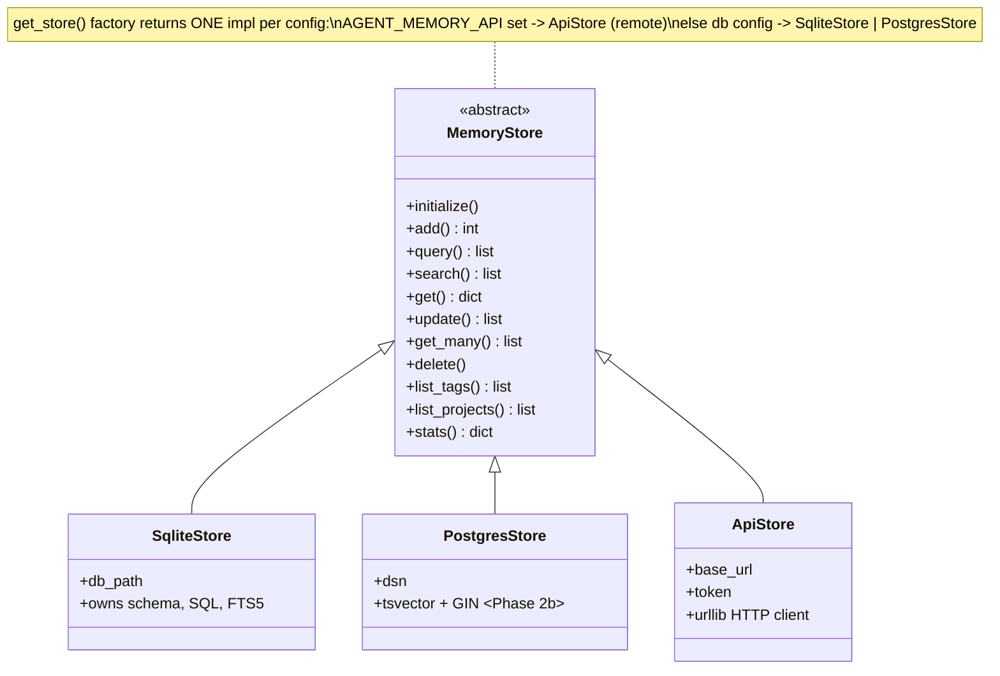
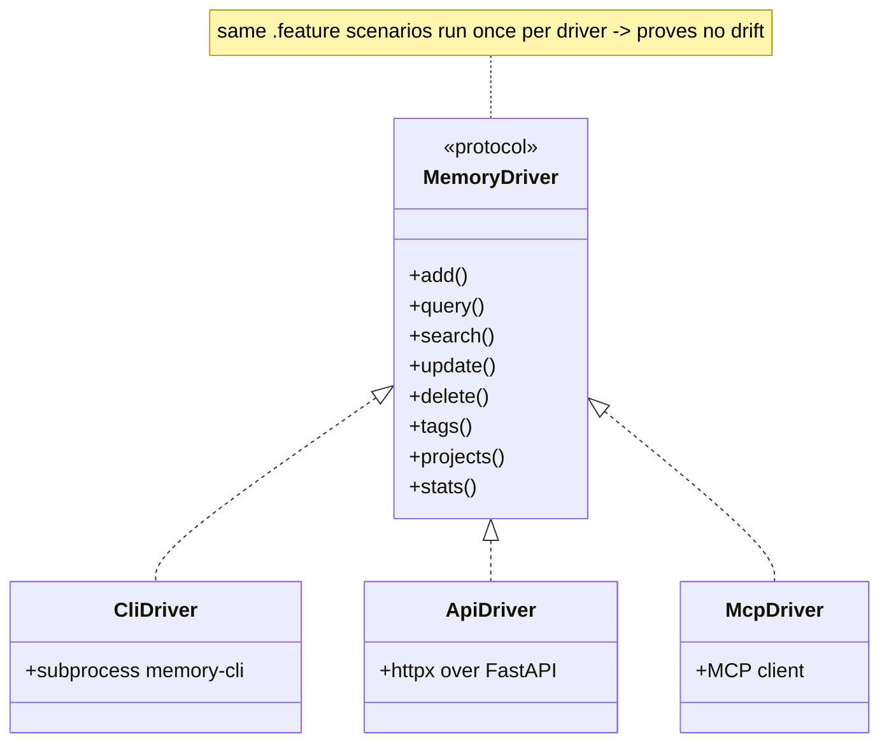
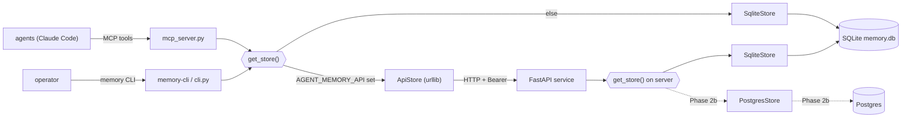
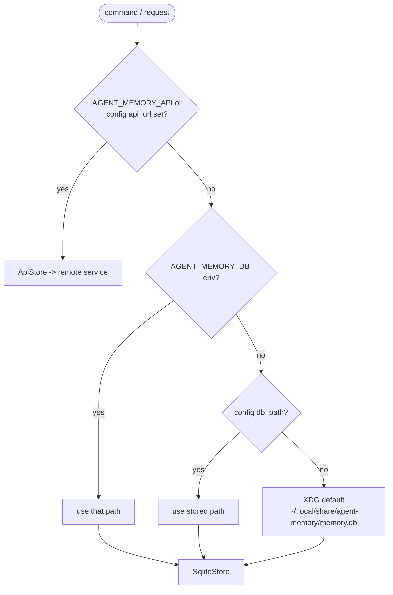
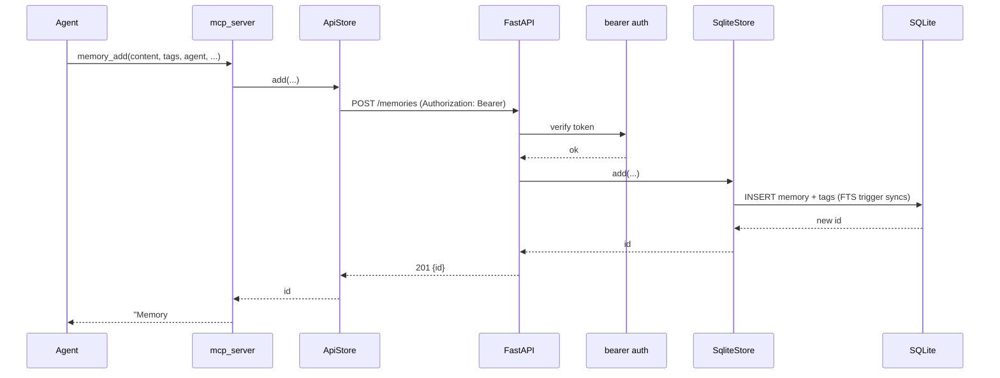
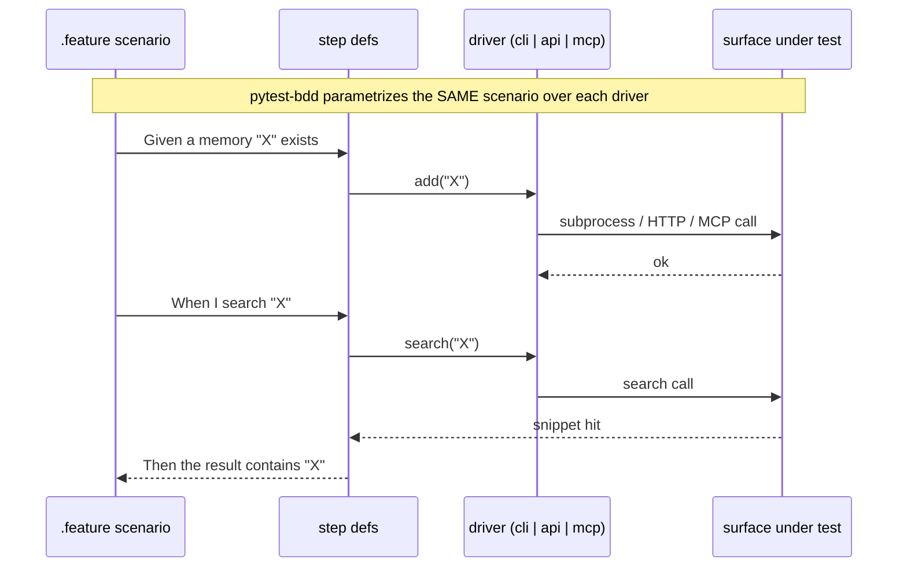

# Plan: Centralize agent-memory behind a hosted API + MCP

> Living plan doc. Edited in place each iteration; `git log -p -- PLAN.md` is the
> per-iteration history (no in-file revision log, no versioned copies).

## Context

Today `memory-cli` is a single-file, stdlib-only Python CLI talking to a **live, shared
SQLite DB** (`~/.local/share/agent-memory/memory.db`, ~108+ memories) that every agent
session uses for continuity. It's already cleanly layered: a `MemoryStore` ABC, a
`SqliteStore` implementation, and a `get_store()` seam whose comments explicitly anticipate
an `ApiStore` (issues **#6** ApiStore, **#7** cloud service + remote MCP, under epic **#8**).

We're now executing Phase 2: **centralize memory behind an HTTP API** (FastAPI) hostable
locally or on the LAN, so every agent on every machine shares one store and connects over
**MCP** instead of copying a CLI around. Decisions confirmed with the user:

- **Stack:** FastAPI + uvicorn (Python — reuse the existing store layer).
- **DB:** SQLite first (reuse the live DB); **Postgres pluggable** as a follow-up backend.
- **Surfaces:** MCP replaces the Skill for agents; CLI is kept but repointed at the API via
  `ApiStore`; the Skill is discarded.
- **Exposure:** Local + LAN with **bearer-token auth** (no public TLS work this phase).

### Key architectural decision (approved)

To reuse one store implementation behind the API, the CLI's `ApiStore`, and the MCP server
— and avoid SQL/schema **drift on a live shared DB** — the storage + config layer moves out
of the single `memory-cli` script into an importable package `agent_memory`. This
**reverses** the Phase-1 "single-file / no importable module" guideline (#2, #8) and the
`script-files` packaging choice. **Preserved:** the `memory-cli` executable name and the
`memory` alias/path (rule #5) — only the internals move. Distribution is already pip-based,
so an installed package is the natural model. The *client surface* (store + CLI + ApiStore)
stays **stdlib-only** (ApiStore uses `urllib`); only the **server** and **MCP** extras pull
in third-party deps — this resolves the "stdlib only" rule (#3) by scoping it to the client.

## Testing strategy — BDD (Gherkin via pytest-bdd)

The plan's core risk is **behavior drift across surfaces** (CLI / HTTP API / MCP all front
one store and must behave identically). The defense is **one set of Gherkin scenarios run
against all three surfaces** through a shared driver abstraction — assert a behavior once,
prove it everywhere.

- **Framework: `pytest-bdd`** (not behave). One pytest runner; the cross-surface driver is
  injected as an ordinary fixture parametrized over `{cli, api, mcp}`, and the FastAPI
  `TestClient`/`httpx` fit the same model. `[dev]`-only deps — never touches the stdlib-only
  *client* rule (#3).
- **Shared driver contract.** A `MemoryDriver` protocol (`add/query/search/show/update/
  delete/tags/projects/stats`) with three implementations: `CliDriver` (subprocess, scratch
  `AGENT_MEMORY_DB`), `ApiDriver` (`httpx` over the running app), `McpDriver` (MCP client).
  Step definitions call the driver, never a surface directly — so the same `.feature` files
  execute against each driver as its ticket lands.
- **Migrate-before-refactor (de-risks Ticket A).** Author the Gherkin suite against *today's*
  single-file CLI and prove it green **first**; retire `tests/test_memory_cli.py` only once
  the new suite reaches behavior parity. The new suite then stands guard through the package
  extraction. "Capture behavior first," and no safety-net gap during the riskiest step.
- **Live DB never touched** — every driver runs against a scratch `AGENT_MEMORY_DB` / a test
  server over one (rule #1).

## Target structure

```
agent-memory/
  pyproject.toml            # package agent_memory; console_script memory-cli=agent_memory.cli:main
                            #   extras: [server] fastapi,uvicorn[standard]  [mcp] mcp
                            #           [dev] pytest, pytest-bdd, httpx
  src/agent_memory/
    __init__.py
    config.py               # moved: _xdg, config_path, load/save_config, default_db_path,
                            #        resolve_db_path, get_agent_name + new resolve_api()
    store.py                # moved: MemoryStore, SqliteStore; NEW ApiStore (urllib); get_store()
    cli.py                  # moved: argparse + presentation + main()
    server/
      app.py                # FastAPI app + routes over get_store()
      auth.py               # bearer-token dependency
      schemas.py            # pydantic request/response models
      __main__.py           # `python -m agent_memory.server` → uvicorn
    mcp_server.py           # MCP server wrapping get_store() (stdio; remote-capable via API)
  memory-cli                # thin shim kept at repo root: `from agent_memory.cli import main; main()`
  tests/
    features/               # Gherkin .feature files — surface-agnostic behavior specs
    conftest.py             # driver fixture parametrized over {cli, api, mcp}
    drivers.py              # MemoryDriver protocol + CliDriver / ApiDriver / McpDriver
    step_defs/              # pytest-bdd step definitions (call driver, never a surface)
```

## Architecture diagrams

### Class diagram — store hierarchy (the seam everything hangs off)



### Class diagram — test drivers (one behavior contract, three surfaces)



### Flow — component topology (local-direct and remote-via-API paths coexist)



### Flow — `get_store()` resolution (preserves the existing precedence)



### Sequence — agent adds a memory via MCP, through the API, to the DB



### Sequence — one Gherkin scenario, run per driver (the anti-drift guarantee)



## Deliverables (one ticket / branch / PR each, per project conventions)

**Ticket A0 — BDD harness + migrate the 41 characterization tests to Gherkin (test-first).**
Stand up `pytest-bdd`, the `MemoryDriver` protocol, and `CliDriver` (subprocess against a
scratch `AGENT_MEMORY_DB`). Port every behavior in `tests/test_memory_cli.py` into `.feature`
scenarios + step defs; prove green against **today's** single-file `memory-cli`; delete the
old unittest file only after parity. **Acceptance:** `pytest` green against the unchanged
script; coverage parity with the retired 41 tests.

**Ticket A — Extract storage + config into importable `agent_memory` package (keystone).**
Pure refactor, with the A0 Gherkin suite as the safety net. Move `MemoryStore`/`SqliteStore`
→ `store.py`, config/path helpers → `config.py`, CLI argparse+formatting → `cli.py`.
`memory-cli` becomes a shim importing the package. Switch `pyproject.toml` from `script-files`
to a real package + `console_scripts` entry point (name unchanged). **Acceptance:** the A0
suite stays green via `CliDriver`; `memory` alias + path still work against the live DB.

**Ticket B — FastAPI service over the shared store (SQLite backend) + bearer auth.** REST
endpoints mirroring `MemoryStore`:
| Method | Route | Store call |
|---|---|---|
| POST | `/memories` | `add` |
| GET | `/memories` (today/yesterday/since/until/project/agent/tag/type/limit) | `query` |
| GET | `/memories/search?q=` (project/agent/tag/since/limit) | `search` (+snippet) |
| GET | `/memories/{id}` | `get` |
| PATCH | `/memories/{id}` | `update` |
| DELETE | `/memories?ids=` | `delete` (returns the dry-run preview data) |
| GET | `/tags` · `/projects` · `/stats` | `list_tags`/`list_projects`/`stats` |
| GET | `/health` | no auth, liveness |

Auth: `Authorization: Bearer <token>`, expected token from `AGENT_MEMORY_API_TOKEN` env;
per-agent attribution stays via the `agent` field in the request body. App calls
`get_store()` so it serves whatever backend config resolves. Add **`ApiDriver`** (httpx) and
run the existing `.feature` suite against it. **Acceptance:** server runs via
`python -m agent_memory.server`; the same Gherkin scenarios pass through `ApiDriver`; route
tests cover 401 on bad token. **Never run against the live DB without a backup — test against
`AGENT_MEMORY_DB` scratch file (rule #1).**

**Ticket C — `ApiStore(MemoryStore)` over HTTP (stdlib `urllib`) + `get_store()` selection
(#6).** Implements the full contract against the REST API. `get_store()` resolves
`AGENT_MEMORY_API` (url + token, or stored `api_url`/`api_token` config) → `ApiStore`; else
`SqliteStore`. Nothing above the store layer changes. **Acceptance:** with `AGENT_MEMORY_API`
set, every CLI command operates against the running service with identical UX — proven by the
A0 `.feature` suite passing through `CliDriver` while pointed at the API.

**Ticket D — MCP server + discard the Skill (#7, partial).** `mcp_server.py` exposes tools
`memory_add/query/search/show/update/delete/tags/projects/stats` by wrapping `get_store()`
— so it talks SQLite directly when local and through the API when `AGENT_MEMORY_API` is set
(one code path, remote-capable). stdio transport for Claude Code config; note
streamable-http transport as a near follow-up for a true remote MCP endpoint. Add
**`McpDriver`** (MCP client) and run the `.feature` suite against it — all three surfaces now
share one behavior contract. Remove `skills/memory/`, the `.claude` skill symlink, and skill
references in docs. **Acceptance:** the Gherkin suite passes through `McpDriver`.

**Ticket E — Docs, packaging extras, run scripts.** Update `ARCHITECTURE.md` (API + backend
strategy + auth), `MEMORY.md` (MCP-first protocol; CLI/`AGENT_MEMORY_API` notes),
`README.md`, `CLAUDE.md` (new package layout, server/mcp run commands, revised stdlib/single-
file rules). Fix the stale `install.sh` (still points at `~/workspace/agents`). Log the
user-visible changes to the DB as `--type=decision` (no CHANGELOG, rule #4).

### Follow-up (Phase 2b, separate ticket — not in this batch)
**Ticket F — `PostgresStore` backend (tsvector/GIN full-text) + SQLite→Postgres migration
command.** Config/env selects the engine; `psycopg[binary]` added to the `[server]` extra.
This is where the SQLite-FTS5 vs Postgres-FTS divergence is handled, behind the same
`MemoryStore` contract.

## Reuse (don't rewrite)
- `MemoryStore` ABC + `SqliteStore` (`memory-cli:68-499`) — moved verbatim, the API/MCP call
  it through `get_store()` (`memory-cli:496`).
- Config/path resolution (`memory-cli:24-52`) and `get_agent_name` (`memory-cli:59`).
- `tests/test_memory_cli.py` — its behaviors are **ported into Gherkin** (Ticket A0) and the
  subprocess+scratch-`AGENT_MEMORY_DB` pattern is reused by `CliDriver`; the file is then
  retired.

## Verification (end-to-end, against a scratch DB only)
1. `export AGENT_MEMORY_DB=/tmp/mem-scratch.db`
2. `pytest` → the full Gherkin suite green across every wired-up driver (CLI now; API/MCP as
   their tickets land — `pytest -k api`, `-k mcp`).
3. `python -m agent_memory.server` (with `AGENT_MEMORY_API_TOKEN=dev`), then:
   - `curl -s localhost:8000/health`
   - `curl -H 'Authorization: Bearer dev' -X POST localhost:8000/memories -d '{...}'`
   - bad/no token → `401`.
4. `AGENT_MEMORY_API=http://localhost:8000 AGENT_MEMORY_API_TOKEN=dev memory query` →
   identical output to direct SQLite.
5. MCP: register `mcp_server.py` (stdio) and exercise `memory_add`/`memory_search` from an
   agent; confirm writes land via the API when `AGENT_MEMORY_API` is set.
6. Back up the live DB before pointing the server at it for real; verify row counts
   before/after (rule #1).
